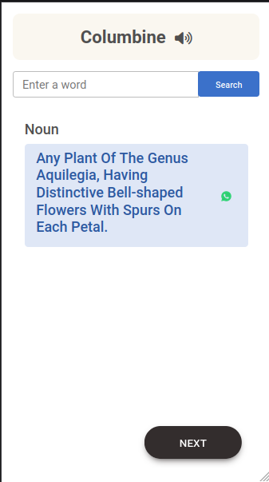
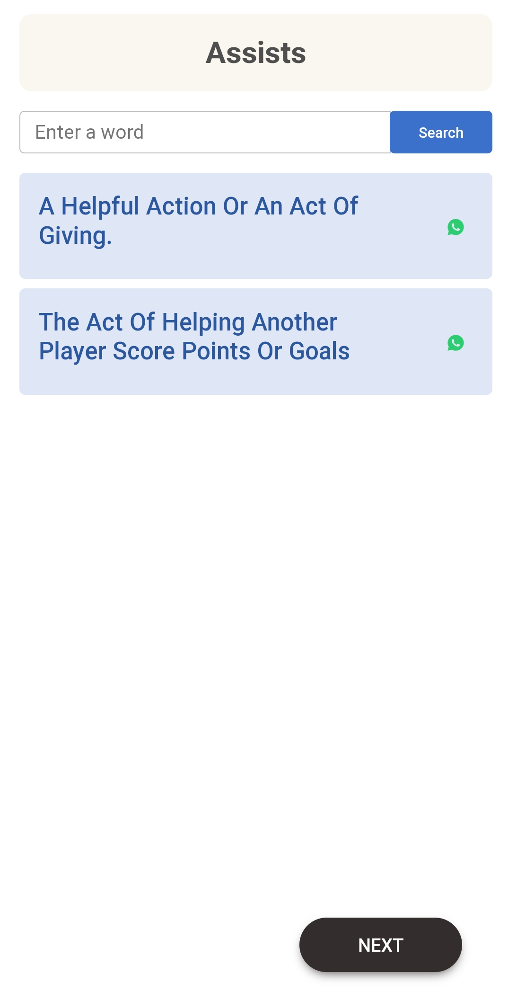
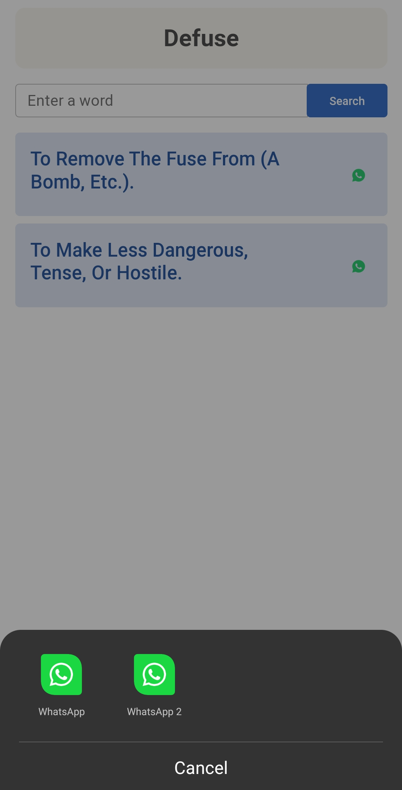

<style>
.img {

}
</style>
# Automatically generated Words and their examples

This is a web app only mobile design is now available, also you can try (add to home screen)

## Features:

* Search included (you can search any words and see the meanings and examples)
* Share words and examples (you can share words and their examples with whatsapp)

## Used languages
 1. HTML
 2. CSS
 3. JS

<br/>
<p align="center">

</p>

&nbsp;&nbsp;&nbsp;&nbsp;&nbsp;&nbsp;&nbsp;&nbsp; &nbsp;&nbsp;&nbsp;&nbsp;&nbsp;&nbsp;&nbsp;&nbsp;
<br/>
<br/>
<br/>
&nbsp;&nbsp;&nbsp;&nbsp;&nbsp;&nbsp;&nbsp;&nbsp;&nbsp;&nbsp;&nbsp;&nbsp;&nbsp;&nbsp;&nbsp;&nbsp;
&nbsp;&nbsp;&nbsp;&nbsp;&nbsp;&nbsp;&nbsp;&nbsp; &nbsp;&nbsp;&nbsp;&nbsp;&nbsp;&nbsp;&nbsp;&nbsp; 

## Contribute

If you have any idea Please shear with me

#### Fork the repo

#### To clone this project, run the following command:
```git
git clone https://github.com/Rahul0070050/wordsAndExamples.git
```

#### Go to the directory
```git
cd wordsAndExamples
```

#### Create a new branch for your changes
```git
git branch <branch-name>
```

#### Commit your changes
```git
git add . && git commit -m "<commit massage>"
```

#### Push the code to repo and Make a pull request
```git
git push origin <your-branch>
```

### Thank you for your time

<br/>

## Support

<a href="https://www.buymeacoffee.com/rahulor0070050" target="_blank"></a>